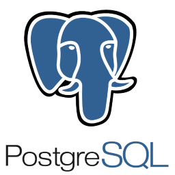

## **👋 Hello! I'm Gustavo**

Welcome to my github page! I'm a geophysics undergraduate student and teaching assistant in computer programming discipline at Universidade Federal Fluminense (Rio de Janeiro/Brazil). 

- 🔭 I'm interested in data science and back-end development
- 🌱 I’m currently learning ```SQL``` with [URI Online Judge](https://www.urionlinejudge.com.br/judge/pt/profile/276482).
- 👯 I’m looking to collaborate with geoscientific projects

### **⭐ GitHub Stats**


### **⚡ My Languages**

<code></code> | <code></code> | <code></code>
--- | --- | ---

### **👯 How to reach me**

[](https://www.linkedin.com/in/gdssouza/)
[](mailto:gdssouza@id.uff.br)

<!--
**gdssouza/gdssouza** is a ✨ _special_ ✨ repository because its `README.md` (this file) appears on your GitHub profile.

Here are some ideas to get you started:

- 🔭 I’m currently working on ...
- 🌱 I’m currently learning ...
- 👯 I’m looking to collaborate on ...
- 🤔 I’m looking for help with ...
- 💬 Ask me about ...
- 📫 How to reach me: ...
- 😄 Pronouns: ...
- ⚡ Fun fact: ...
-->

